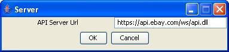
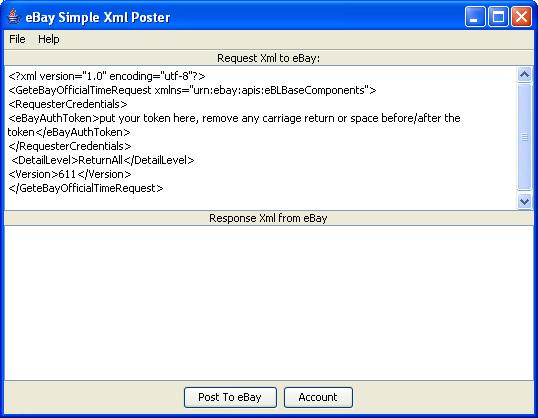

# simpleXmlPost

It demonstrates how to use ApiSchemaBasedXmlPoster class to send eBay API XML to make traditional (non-SOAP) XML API call. Please refer to
the [README](../README.md) of samples for build instructions.

Usage:

1. In main window, click Account to fill Api server address.
2. Paste your request Xml(including your token) in the top text box.
3. Click button "Post To eBay" to send the XML request to eBay. Upon success, the response XML will be displayed in the bottom text box.

