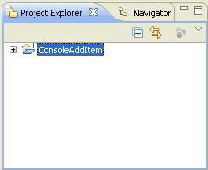
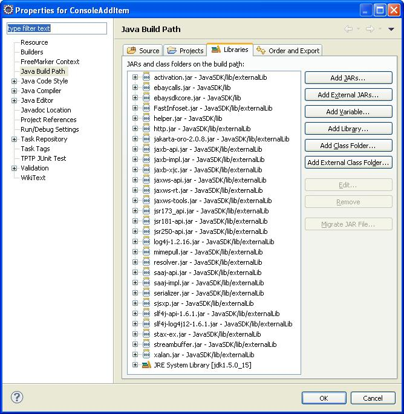
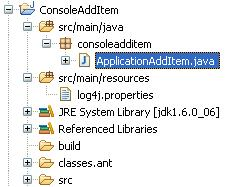
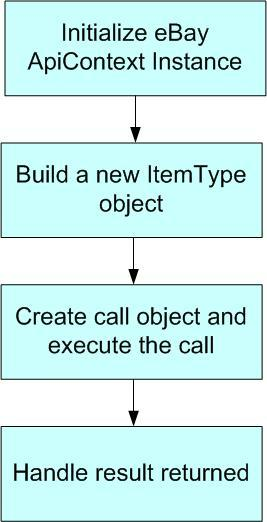
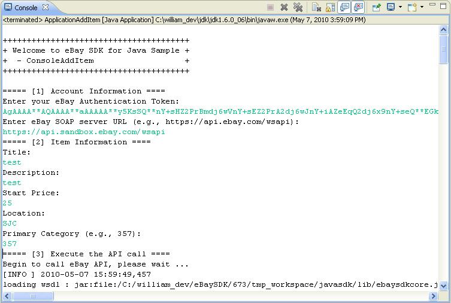
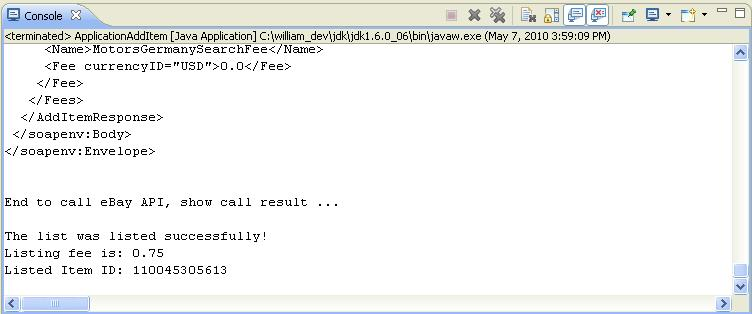

# Console Add Item – eBay API/SDK Tutorial for Java

This tutorial shows the bare minimum to create a new listing on eBay site using eBay SDK/API.

You can find the code used in this tutorial in the project file for this tutorial in the samples folder of the Java SDK package.

**Prerequisites**

1. eBay Trading SDK for Java
2. Sun JDK 1.8
3. An eBay user token
4. Eclipse 3.x (or other Java IDE)

## Steps to Create the Console Add Item Sample:

**1.** Create a Java Project called ConsoleAddItem in Eclipse (see Fig 1).



Fig 1. ConsoleAddItem Project

**2.** Add the following libraries in the project's build path (Properties -\> Java Build Path -\> Libraries; see Fig 2):

1. **SDK libraries** : ebaysdkcore.jar, ebaycalls.jar, helper.jar in {JavaSDK}\lib\
2. **JAXWS-RI and other libraries** : all jars in {JavaSDK}\lib\externalLib\, not including jars in optional sub-folder.
3. **JRE System Library**

Notes:

1. eBay SDK library is the main component of the SDK, encapsulating eBay API calls and hiding the low-level communication details from you.
2. JAXWS-RI and Other libraries are third-party libraries. The eBay SDK has build-time and run-time dependency on these libraries.



Fig 2. Add Libraries in Build Path

**3.** Create a log4j configuration file called log4j.properties (see Listing 1) under the src/main/resources folder. With this file added, SDK is configured to use log4j as the underlying logging framework, and it will log all of the communication to console as defined in the log4j.properties. If anything goes wrong, logging is extremely helpful for troubleshooting.

Please make sure src/main/resources folder is on build path of the eclipse project.

The eBay SDK uses the Simple Logging Facade for Java(SLF4J), a simple facade for various logging framework, e.g. log4j, java.util.logging. By default, eBay SDK uses log4j as the underlying logging framework, if you prefer, you can switch to another logging framework like java.util.logging, for details, please refer to [Notes About Logging] section in the README document in the root of your SDK installation.

```
# ***** Set root logger level to debug and its appender to stdout.
log4j.rootLogger=DEBUG, stdout

# ***** stdout is set to be a ConsoleAppender.
log4j.appender.stdout=org.apache.log4j.ConsoleAppender
# ***** stdout uses PatternLayout.
log4j.appender.stdout.layout=org.apache.log4j.PatternLayout
# ***** Pattern to output the caller's file name and line number.
log4j.appender.stdout.layout.ConversionPattern=[%-5p] %d%n%m%n%n
```

Listing 1. Logging Configuration

**4.** Create a Main Program class called ApplicationAddItem.java under src/main/java/consoleadditem folder (see Fig 3), import the following Java and SDK classes so we can have reference to calls and classes in the SDK and provide the package name and class name definition at the same time(see Listing 2).

Please make sure src/main/java folder is on the build path of the Eclipse project.



Fig 3. The Main Program Class

```java
package consoleadditem;

import java.io.IOException;

import com.ebay.sdk.ApiContext;
import com.ebay.sdk.ApiCredential;
import com.ebay.sdk.call.AddItemCall;
import com.ebay.sdk.helper.ConsoleUtil;
import com.ebay.sdk.util.eBayUtil;
import com.ebay.soap.eBLBaseComponents.AmountType;
import com.ebay.soap.eBLBaseComponents.BuyerPaymentMethodCodeType;
import com.ebay.soap.eBLBaseComponents.CategoryType;
import com.ebay.soap.eBLBaseComponents.CountryCodeType;
import com.ebay.soap.eBLBaseComponents.CurrencyCodeType;
import com.ebay.soap.eBLBaseComponents.FeesType;
import com.ebay.soap.eBLBaseComponents.ItemType;
import com.ebay.soap.eBLBaseComponents.ListingDurationCodeType;
import com.ebay.soap.eBLBaseComponents.ListingTypeCodeType;
import com.ebay.soap.eBLBaseComponents.ReturnPolicyType;
import com.ebay.soap.eBLBaseComponents.ShippingDetailsType;
import com.ebay.soap.eBLBaseComponents.ShippingServiceCodeType;
import com.ebay.soap.eBLBaseComponents.ShippingServiceOptionsType;
import com.ebay.soap.eBLBaseComponents.ShippingTypeCodeType;

public class ApplicationAddItem {
```

Listing 2. Import Classes

**5.** In order to call eBay APIs, first you need to initialize an ApiContext object. ApiContext object contains all the configurations and settings that are necessary for calling eBay APIs.

In the main Program class, create a function called getApiContext (see Listing 3). In this function, we populate the ApiContext object with the user token and the server Url input by a user in the console.

```java
  /**
   * Populate eBay SDK ApiContext object with data input from user
   * @return ApiContext object
   */
  private static ApiContext getApiContext() throws IOException {
	  
      String input;
      ApiContext apiContext = new ApiContext();
      
      //set Api Token to access eBay Api Server
      ApiCredential cred = apiContext.getApiCredential();
      input = ConsoleUtil.readString("Enter your eBay Authentication Token: ");
      cred.seteBayToken(input);
     
      //set Api Server Url
      input = ConsoleUtil.readString("Enter eBay SOAP server URL (e.g., https://api.ebay.com/wsapi): ");
      apiContext.setApiServerUrl(input);
      
      return apiContext;
  }
```

Listing 3. getApiContext Function

**6.** In order to list an item on eBay, first you need to create a new instance of the ItemType class.

In the main Program class, create a function called buildItem (see Listing 4). In this function, we populate the item with information such as item title and description, listing category, payment methods, and shipping details. For a detailed discussion about the information you should provide to list an item, please refer to [eBay Trading API documentation](https://developer.ebay.com/api-docs/user-guides/static/trading-user-guide/list-item.html).

```java
  /**
   * Build a sample item
   * @return ItemType object
   */
  private static ItemType buildItem() throws IOException {

      String input;
      ItemType item = new ItemType();

      // item title
      item.setTitle(ConsoleUtil.readString("Title: "));
      // item description
      item.setDescription(ConsoleUtil.readString("Description: "));
      
      // listing type
      item.setListingType(ListingTypeCodeType.CHINESE);
      // listing price
      item.setCurrency(CurrencyCodeType.USD);
      input = ConsoleUtil.readString("Start Price: ");
      AmountType amount = new AmountType();
      amount.setValue(Double.valueOf(input));
      item.setStartPrice(amount);
      
      // listing duration
      item.setListingDuration(ListingDurationCodeType.DAYS_3.value());
      
      // item location and country
      item.setLocation(ConsoleUtil.readString("Location: "));
      item.setCountry(CountryCodeType.US);

      // listing category
      CategoryType cat = new CategoryType();
      cat.setCategoryID(ConsoleUtil.readString("Primary Category (e.g., 30022): "));
      item.setPrimaryCategory(cat);
      
      // item quality
      item.setQuantity(new Integer(1));

      // payment methods
      item.setPaymentMethods(new BuyerPaymentMethodCodeType[] 
	                            {BuyerPaymentMethodCodeType.PAY_PAL});
      // email is required if paypal is used as payment method
      item.setPayPalEmailAddress("me@ebay.com");

      // item condition, New
      item.setConditionID(1000); 

      // handling time is required
      item.setDispatchTimeMax(Integer.valueOf(1));

      // shipping details
      item.setShippingDetails(buildShippingDetails());
      
      // return policy
      ReturnPolicyType returnPolicy = new ReturnPolicyType();
      returnPolicy.setReturnsAcceptedOption("ReturnsAccepted");
      item.setReturnPolicy(returnPolicy);
      
      return item;
  }
```
Listing 4. buildItem Function

**7.** In the main Program class, create a helper function called buildShippingDetails (see Listing 5). This function is used by buildItem function to build sample shipping details.

```java
/**
   * Build sample shipping details
   * @return ShippingDetailsType object
   */
  private static ShippingDetailsType buildShippingDetails()
  {
     // Shipping details.
     ShippingDetailsType sd = new ShippingDetailsType();

     sd.setApplyShippingDiscount(new Boolean(true));
     AmountType amount =new AmountType();
     amount.setValue(2.8);
     sd.setPaymentInstructions("eBay Java SDK test instruction.");

     // Shipping type and shipping service options
     sd.setShippingType(ShippingTypeCodeType.FLAT);
     ShippingServiceOptionsType shippingOptions = new ShippingServiceOptionsType();
     shippingOptions.setShippingService(
		 ShippingServiceCodeType.SHIPPING_METHOD_STANDARD.value());
     amount = new AmountType();
     amount.setValue(2.0);
     shippingOptions.setShippingServiceAdditionalCost(amount);
     amount = new AmountType();
     amount.setValue(10);
     shippingOptions.setShippingServiceCost(amount);
     shippingOptions.setShippingServicePriority(new Integer(1));
     amount = new AmountType();
     amount.setValue(1.0);
     shippingOptions.setShippingInsuranceCost(amount);

     sd.setShippingServiceOptions(new ShippingServiceOptionsType[]{shippingOptions});

     return sd;
  }
```

Listing 5. buildShippingDetails Function

**8.** Now that all building blocks are ready, let's wire them together in the Main function (see Listing 6). The overall call flow is shown in Fig 4:

```java
public static void main(String[] args) {

    try {

      System.out.print("\n");
      System.out.print("+++++++++++++++++++++++++++++++++++++++\n");
      System.out.print("+ Welcome to eBay SDK for Java Sample +\n");
      System.out.print("+  - ConsoleAddItem                   +\n");
      System.out.print("+++++++++++++++++++++++++++++++++++++++\n");
      System.out.print("\n");

      // [Step 1] Initialize eBay ApiContext object
	  System.out.println("===== [1] Account Information ====");
      ApiContext apiContext = getApiContext();
      
      // [Step 2] Create a new item object.
      System.out.println("===== [2] Item Information ====");
      ItemType item = buildItem();
      
      // [Step 3] Create call object and execute the call.
      System.out.println("===== [3] Execute the API call ====");
      System.out.println("Begin to call eBay API, please wait ...");
      AddItemCall api = new AddItemCall(apiContext);
      api.setItem(item);
      FeesType fees = api.addItem();
      System.out.println("End to call eBay API, show call result ...");
      System.out.println();

      // [Setp 4] Display results.
      System.out.println("The list was listed successfully!");

      double listingFee = eBayUtil.findFeeByName(fees.getFee(), "ListingFee").getFee().getValue();
      System.out.println("Listing fee is: " + new Double(listingFee).toString());
      System.out.println("Listed Item ID: " + item.getItemID());
    }
    catch(Exception e) {
      System.out.println("Fail to list the item.");
      e.printStackTrace();
    }
  }
```

Listing 6. The Main Function



Fig 4. The Call Flow

After the ItemType instance is created, we call the AddItem API and pass in the newly created ItemType instance as a parameter. If the call is successful, a FeesType class instance will be returned. This class instance contains all of the individual fees resulting from the item listing. Lastly, we output the Listing fee and Listed Item ID to the console (for your application you can handle the response according to your own requirements). The main function also shows basic exception handling; if anything goes wrong, you are responsible for catching and handling exceptions.

**9.** Run the Main Program in Eclipse. Input the user token, Server Url and some item information upon request. You will see following output in the console window (see Fig 5.). If anything goes wrong, you can check the log in the console for troubleshooting:





Fig 5. Console Output

**10.** If the listing is successful, you can verify the item by searching the item ID in the eBay sandbox (or in production, if you configured the production API server Url in the application configuration file) (see Fig 6).

Now you have a working sample which can list item to eBay site using eBay SDK. Congratulations!