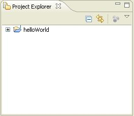
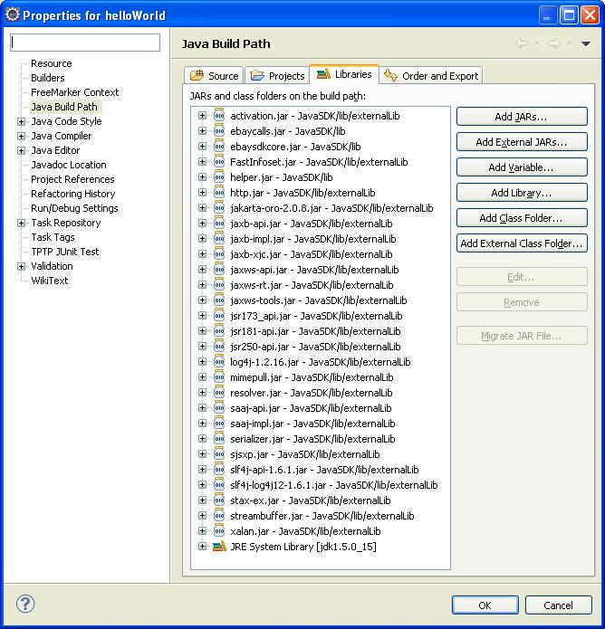
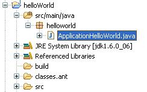
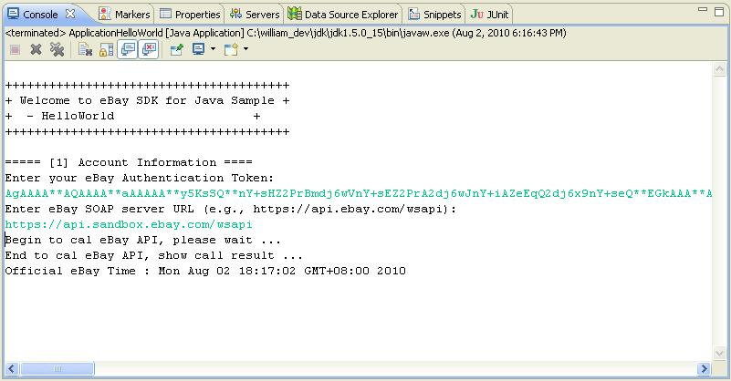
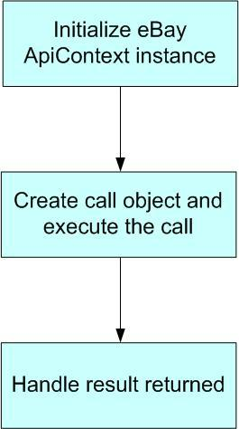

# Hello World – eBay API/SDK Tutorial for Java

This tutorial shows the bare minimum to get started with eBay API/SDK.

You can find the code used in this tutorial in the project file for this tutorial in the samples folder of the Java SDK package.

## Prerequisite:

1. eBay Trading SDK for Java
2. JDK 1.8
3. An eBay user token
4. Eclipse 3.x (or other Java IDE).

## Steps to Create the Hello World Sample:

1. Create a new Java Project called helloWorld in Eclipse (see Fig 1).

   

    Fig 1. HelloWorld Project

2. Add the following libraries to the project's build path (_Properties -\> Java Build Path -\> Libraries_, as shown in Fig 2):

3. **SDK libraries** : ebaysdkcore.jar, ebaycalls.jar, helper.jar in {JavaSDK}\lib\
4. **JAXWS-RI and other libraries** : all jars in {JavaSDK}\lib\externalLib\, not including jars in optional sub-folder.
5. **JRE System Library**

Notes

1. The eBay SDK library is the main component of the SDK. It encapsulates eBay API calls and hides the low-level communication details from you.
2. JAXWS-RI and other libraries are third-party libraries. The eBay SDK has build-time and run-time dependencies on these libraries.

    

    Fig 2. Add Libraries in Build Path

3. Add the following code (see Listing 1) to the main Program class, ApplicationHelloWorld.java (see Fig 3).

    

    Fig 3. Main Program

```java
package helloworld;

import java.io.IOException;
import java.util.Calendar;

import com.ebay.sdk.ApiContext;
import com.ebay.sdk.ApiCredential;
import com.ebay.sdk.helper.ConsoleUtil;
import com.ebay.sdk.call.GeteBayOfficialTimeCall;

/**
 * A Hello World-like sample, 
 * showing how to call eBay API using eBay SDK.
 *
 * @author boyang
 *
 */
public class ApplicationHelloWorld {

    /**
     * @param args
     */
    public static void main(String[] args) {
        try {

            System.out.print("\n");
            System.out.print("+++++++++++++++++++++++++++++++++++++++\n");
            System.out.print("+ Welcome to eBay SDK for Java Sample +\n");
            System.out.print("+  - ConsoleAddItem                   +\n");
            System.out.print("+++++++++++++++++++++++++++++++++++++++\n");
            System.out.print("\n");

            // [Step 1] Initialize eBay ApiContext object
            System.out.println("===== [1] Account Information ====");
            ApiContext apiContext = getApiContext();

            // [Step 2] Create call object and execute the call
            GeteBayOfficialTimeCall apiCall = new GeteBayOfficialTimeCall(apiContext);
            System.out.println("Begin to cal eBay API, please wait ... ");
            Calendar cal = apiCall.geteBayOfficialTime();
            System.out.println("End to cal eBay API, show call result ...");

            // [Setp 3] Handle the result returned
            System.out.println("Official eBay Time : " + cal.getTime().toString());
        }
        catch(Exception e) {
            System.out.println("Fail to get eBay official time.");
            e.printStackTrace();
        }

    }

    /**
     * Populate eBay SDK ApiContext object with data input from user
     * @return ApiContext object
     */
    private static ApiContext getApiContext() throws IOException {

        String input;
        ApiContext apiContext = new ApiContext();

        //set Api Token to access eBay Api Server
        ApiCredential cred = apiContext.getApiCredential();
        input = ConsoleUtil.readString("Enter your eBay Authentication Token: ");
        cred.seteBayToken(input);

        //set Api Server Url
        input = ConsoleUtil.readString(
            "Enter eBay SOAP server URL (e.g., https://api.ebay.com/wsapi): ");
        apiContext.setApiServerUrl(input);

        return apiContext;
    }

}
```
Listing 1. Source Code of the Program

5. Run the Main Program in Eclipse. Input your token and API Server address upon request. You will see following output in the Eclipse Console window (see Fig 4):

    

    Fig 4. Console Output

Note:

If you receive a log4j warning which says that log4j is not configured properly, just ignore it. We'll show how to configure log4j in another tutorial (ConsoleAddItem Tutorial).

This sample will call the GeteBayOfficialTime API to get eBay official time. If everything works correctly, you will see eBay official time returned in the console output.

Now you have a working sample which can call eBay API using eBay SDK. Congratulations!

## Call Flow Analysis

A typical eBay API/SDK call paradigm (see Fig 5) involves three steps. Below is an analysis of each step. Please use the source code listed above (Listing 1) as a reference.



Fig 5. Typical eBay API/SDK Call Paradigm

**[Step 1] Initialize eBay ApiContext object**

In order to call the eBay API, first you need to initialize an ApiContext object. The ApiContext object contains all the configurations and settings that are necessary for calling the eBay API.

In the sample, we populate the ApiContext object with the user token and server Url input by the user in the Console.

There are other configurations and settings on the ApiContext object. This sample only shows the bare minimum; please refer to SDK doc and source code for more details.

**[Step 2] Create call object and**  **execute**  **the call**

For each eBay API call, there is a corresponding wrapper class in the SDK. For example, GeteBayOfficialTimeCall is a wrapper class for the GeteBayOfficialTime API call.

In the sample, we created a new instance of the GeteBayOfficialTimeCall wrapper class, then we called its GeteBayOfficalTime() method. If the call was successful, a Calendar class instance containing eBay official time was returned.

Because of the wrapper class, you only need to write a few lines of code to talk to eBay server. The eBay SDK handles the low-level communications with eBay servers for you.

**[Step 3] Handle the result returned**

You can handle the response according to your own requirements. In the sample, we just output the returned eBay official time to the console.
